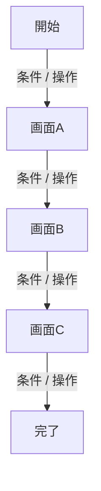

# [ジャーニー名] 画面遷移

- 主な actor:
- 対応ユースケース:
- 関連 Bounded Context:
- 開始条件:
- 完了条件:

## 0. この遷移図の目的

- [記入]

## 1. 画面遷移図

## 2. 遷移条件

| From | Trigger / 条件 | To | 補足 |
| --- | --- | --- | --- |
| [記入] | [記入] | [記入] | [記入] |

## 3. 例外・離脱・差し戻し

| 場面 | 何が起きるか | 遷移先 / 扱い | 備考 |
| --- | --- | --- | --- |
| [記入] | [記入] | [記入] | [記入] |

## 4. 関連文書

- 体験スコープ:
- 関連ジャーニー:
- 関連ユースケース:
- 関連画面一覧:
- 関連画面構造:
